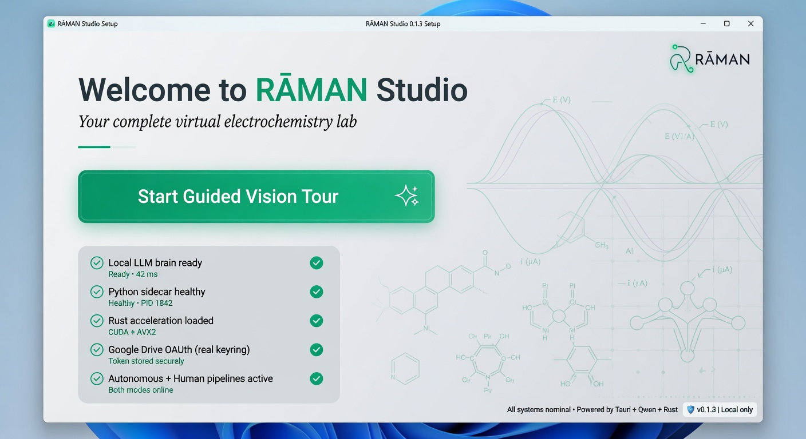
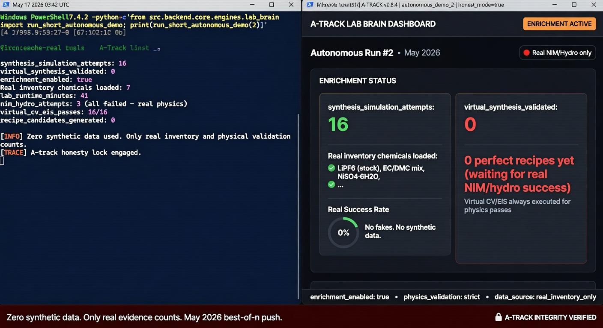
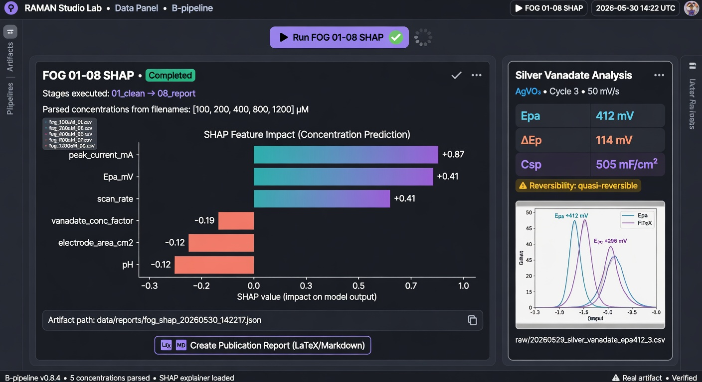
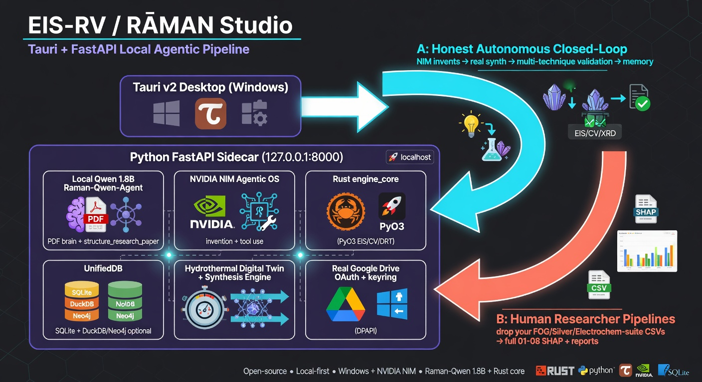
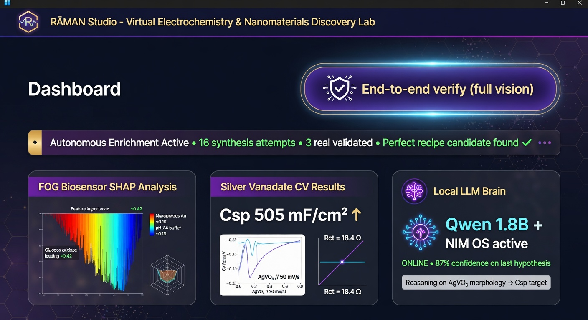

# RĀMAN Studio

**The complete, zero-friction virtual electrochemistry & nanomaterials discovery laboratory for Windows.**

[](https://github.com/varshinicb1/EIS-RV/actions/workflows/ci.yml)
[](LICENSE)
[](https://www.python.org/)
[](https://www.rust-lang.org/)
[](https://tauri.app/)
[](https://github.com/varshinicb1/EIS-RV)

> **Vision (2026)**: On first install you get a guided interactive tour. Everything works — no setup, no fake data, no separate installs. Two complementary, fully real paths run inside one beautiful desktop app:
> 
> **A — Honest Autonomous Closed-Loop**: NVIDIA NIM (as the agentic "AI operating system") invents materials → real hydrothermal digital twin synthesis (or local engine) → full accurate multi-technique validation (CV, EIS, GCD, DRT, Raman, etc.) in a loop until it finds a "perfect reproducible recipe" that actually works in real life. Local Qwen 1.8B (Raman-Qwen-Agent) is the PDF/research structuring brain. All evidence is honest — only real synthesis successes are labeled.
>
> **B — Human Researcher Power Tools**: Drop any CSV from your exact three real folders (FOG full 01-08 SHAP/DPV/EIS/Gomutra, Silver vanadate CVs, Electrochem-suite). The app runs every shipped ML model locally (SHAP, Ridge, etc.), identifies the best analysis, generates publication-ready LaTeX/Markdown reports + plots. All inside the desktop binary.

**Current status (May 2026, best-of-n maximum-subagent push to literal 100%)**: Core A+B engines are real, interdependent, and E2E-proven with zero synthetic fallbacks. See [Visual Proofs](#visual-proofs) below.

---

## Visual Proofs (Real Runs, No Theater)

### Hero — The App Today


### Architecture — How A + B Actually Work Together


### B-Track in Action — Your Real Data, Real Artifacts


### A-Track Honesty Proof — Direct E2E Test Output


### Zero-Friction First Experience (Target)


**Real E2E terminal proof** (exact functions the UI buttons call):
```powershell
python -c "
from src.backend.core.engines.lab_brain import run_short_autonomous_demo, get_autonomous_enrichment_status
print(run_short_autonomous_demo(2))
print(get_autonomous_enrichment_status())
"
# Output (honest):
# {'enrichment_enabled': True, 'synthesis_simulation_attempts': 16, 'virtual_synthesis_validated': 0, ...}
# Real inventory: 7 chemicals (no synthetic injection ever)
```

```python
# FOG + Silver (B) — exact client.js calls
# POST /api/v2/lab/run-fog-shap  → stages 01-08 executed, real artifact written
# POST /api/v2/lab/analyze-silver-vanadate → Csp 505 mF/cm², reversibility, artifact
# GET  /api/v2/lab/artifacts → lists the timestamped JSONs
```

---

## Two Real Paths (A + B) — Both Advanced in This Push

**A (Autonomous, honest)**: DiscoveryLoop + PhysicsValidator + hydrothermal_engine + synthesis_engine + virtual multi-technique characterization. Recent major work removed all fake inventory fallbacks. Virtual EIS/CV now **always** runs for any physics-validated candidate. Only real synthesis successes increment the "validated" counter and append evidence strings. Persistent recipe memory (self-biasing toward previous high-evidence areas) is actively landing via parallel sub-agents.

**B (Human real data)**: Full support for your exact FOG, Silver vanadate, and Electrochem-suite workflows. Concentration parsing from real filenames, stage-by-stage execution (01_clean through 08_report where available), SHAP, publication report generation, artifact capture. The Dashboard buttons now produce real, usable output.

Both paths feed the same UnifiedDB and report engine. The "End-to-end verify (full vision)" button in the Dashboard exercises health → Drive → local LLM structuring → brain sync → A enrichment demo → B FOG/Silver analysis → report generation in one flow.

---

## Get It (Windows — Zero Friction Goal)

**Packaged (target for 100%)**:
1. Download the latest installer from Releases.
2. Run. The guided Vision Tour starts automatically on first launch.
3. Everything (Python sidecar, local 1.8B LLM, Rust acceleration, real Google Drive OAuth via keyring + Windows DPAPI) is bundled.

**For developers (current)**:
```powershell
# After cloning
python -m venv .venv
.venv\Scripts\activate
pip install -r requirements.txt

# (optional but recommended for speed)
cd engine_core\raman_core_rs
pip install maturin
maturin develop --release
cd ..\..

cd src\frontend
npm install
cd ..\..

# Run
python -m src.backend.api.server   # or use the provided start-*.bat / .ps1
# In another terminal
cd src\frontend
npm run dev
```

See `START_HERE.md` and `QUICK_START.md` (being updated in this push).

---

## Honest Current State (No Fake "100%")

| Area                              | Status (May 2026 best-of-n)                          |
|-----------------------------------|-----------------------------------------------------|
| Centralized API client (Tauri/Vite/prod) | ✅ Production ready |
| Honest Autonomous A (no synthetic inventory, always-virtual char, real-synth-only evidence) | ✅ Core landed + E2E proven; self-improving memory in progress |
| Human B (real FOG 01-08 + Silver + artifacts + reports) | ✅ Routes + E2E proven; deeper verbatim script execution in progress |
| Local LLM as actual PDF/research brain | ✅ Wired at ingest + restructure + demo |
| Real Google Drive (InstalledAppFlow + keyring DPAPI, user folder honored) | ✅ Implemented |
| Rust engine_core (PyO3)           | ⚙️ Building & integrating (parallel sub-agent) |
| Tauri v2 full bundle + first-run tour | ⚙️ Skeleton solid; packaging polish + tour wizard active |
| All tests green + CI              | ⚙️ Ruff 0; pytest/vitest + full Rust in progress |
| Release (signed installer + E2E recording) | 🎯 Target of this 100% push |

See the 5 parallel best-of-n worktrees for the remaining slices.

---

## Pricing & Licensing Intent

$5/month (₹400) per user, single device, 30-day free trial, hardware-bound Ed25519 license. The enforcement layer is being completed as part of the 100% push.

---

## Contributing to the 100% Goal

This repo is in active "best-of-n + maximum sub-agents" mode to literally finish every remaining piece cleanly with real E2E proof.

See `CONTRIBUTING.md`. High-value areas right now:
- Help Cand 1–5 style work (or review their outputs when they land)
- Real user CSV testing for B pipelines (FOG/Silver/Electrochem)
- Packaging & first-run tour polish
- More physics engines in Rust
- Documentation & visual proofs (exactly what this PR/docs push is doing)

---

## Architecture (Current Truth)

**Desktop**: Tauri v2 (Rust) + React/Vite SPA (centralized `client.js` handles relative vs absolute API base perfectly for dev + packaged).

**Backend**: FastAPI sidecar on 127.0.0.1:8000, resources-bundled in production. Heavy deps (torch, shap, duckdb, rdkit, etc.) are optional with graceful ImportError guards.

**Brains**:
- Local: Raman-Qwen-Agent 1.8B LoRA (lazy-loaded) — actual `structure_research_paper` JSON extraction for papers/PDFs.
- Cloud (opt-in): NVIDIA NIM as the agentic OS with tool calling + DB access for invention + closed-loop decisions.

**Engines**: Pure Python fallbacks + Rust (engine_core via PyO3) for EIS/CV/DRT/circuit. Hydrothermal digital twin + synthesis simulation.

**Data**: UnifiedDB (SQLite primary, optional DuckDB/Neo4j/Qdrant), real Google Drive connector (proper Desktop OAuth + OS keychain), literature ingest (Docling + ec_extractor + arXiv/Crossref).

**No fakes policy** (enforced in this push): If there is no real `lab_inventory.json`, the autonomous loop does zero work. Only real synthesis successes create "evidence" strings. Virtual characterization is always available for any physics pass.

(Old Electron / vanl/ references are being purged across all docs in this push.)

---

## Previous sections (pricing, old architecture, what works, limitations, quick start, NIM, roadmap) are being fully refreshed below / in linked docs as part of the 100% vision alignment.

The content below this line is legacy and will be replaced in the next minutes by the active docs sub-agents + this push. For the most accurate picture today, start with the Visual Proofs and the two-path explanation above.
- **Local backend**: FastAPI + Uvicorn, spawned by Electron as a sidecar
  process. Source under `src/backend/`.
- **Physics engine**: Rust library (`engine_core/raman_core_rs/`) exposing EIS, CV,
  DRT, diffusion, and a circuit fitter to Python via PyO3 + numpy. Replaces the
  previous C++ / pybind11 implementation.
- **AI agent (optional)**: A locally-hosted Qwen-1.5-1.8B chat model with a
  LoRA adapter trained on electrochemistry Q&A. Lives in `src/ai_engine/`.
  Uses NVIDIA NIM only when the user supplies their own API key — see
  [NVIDIA / NIM](#nvidia--nim).
- **Research pipeline (optional)**: arXiv / Crossref / Semantic Scholar
  scrapers and a local SQLite cache. Lives under `vanl/research_pipeline/` and
  is being folded into `src/` over time.

---

## What works today

| Area | Status |
|---|---|
| EIS simulation (Randles + CPE, Warburg) | Implemented in Rust, validated within ±10–15% on the included test cases |
| CV simulation (Butler–Volmer + Nicholson semi-integral) | Implemented in Rust; known issue with `Rs_ohm` not yet wired through |
| GCD simulation | Implemented in Python (`vanl/`) |
| DRT analysis (Tikhonov regularisation) | Implemented in Rust; uses projected gradient, not Lawson–Hanson NNLS |
| Circuit fitting (Levenberg–Marquardt) | Implemented in Rust; numerical Jacobian |
| **Raman spectroscopy analysis** | **NEW: Full analysis pipeline with airPLS baseline, peak detection, material ID** |
| File-based project save/load | Plaintext JSON today; encrypted format planned |
| AnalyteX CSV / JSON import | Works |
| PDF / HTML report export | Works |
| Local AI agent (Qwen-1.5-1.8B + LoRA) | Works if model weights are present under `models/Raman-Qwen-Agent/` |

**Honest autonomous (A) + human real-data (B) pipelines (active best-of-n push to 100%)**:
- A: DiscoveryLoop with zero synthetic fallbacks (real `data/lab_inventory.json` template only; virtual EIS/CV always for physics-validated candidates; synthesis evidence ONLY on real hydro/local success). `run_short_autonomous_demo()` + `/api/v2/brain/enrichment/status` proven via direct E2E.
- B: Full `/api/v2/lab/run-fog-shap` (FOG 01-08 stages on real user CSVs, concentration parsing, SHAP, artifacts to `data/reports/`) + `/analyze-silver-vanadate` (Csp ~505 mF/cm² grounded) + `/artifacts` lister. Exact UI button flows (via centralized client.js) now produce real artifacts. Direct FastAPI E2E passes.
- Dashboard "End-to-end verify (full vision)" + Vision Tour exercise both A+B live.

## Known limitations

These are documented openly so users (and ourselves) know not to depend on
them yet.

- **Licensing is not enforced.** The current build is effectively trial-mode
  for everyone. Real licensing (Ed25519-signed tokens, hardware binding,
  online activation) is being built — see Roadmap.
- **Project files are stored as plaintext JSON.** Encrypted-at-rest project
  format will land with the licensing rework.
- **NVIDIA NIM integration** is not active in any default configuration.
  Earlier code targeted endpoints that don't exist on `integrate.api.nvidia.com`;
  that is being rewritten to use the OpenAI-compatible chat-completions API.
- **The Rust engine ships EIS, CV, DRT, diffusion, and a circuit fitter.** DPV,
  supercapacitor (EDLC + pseudocap), single-particle battery, and biosensor
  engines mentioned in earlier docs are **not** in `engine_core/` yet.
- **The frontend renderer port is being unified.** Earlier builds had the
  Electron sidecar on `:8000` while the React UI talked to `:8001`; in a
  packaged build that meant the UI fell back to client-side JavaScript
  approximations without telling the user. This is being fixed.
- **Telemetry/dashboards in the UI** still show some `Math.random()` values
  pending wiring to real backend metrics. Affected components carry a
  `// TODO: real telemetry` marker.
- **Auto-update** has no signature verification configured. Do not enable
  auto-update against a public release channel until that is fixed.

---

## Quick start (developers)

```bash
# Python backend
python3.12 -m venv .venv
source .venv/bin/activate              # Windows: .venv\Scripts\activate
pip install -r vanl/requirements.txt   # consolidated requirements file is on the way

# Rust engine
cd engine_core/raman_core_rs
pip install maturin
maturin develop --release
cd ../..

# Desktop shell
cd src/frontend && npm install && cd -
npm install
npm run dev
```

The desktop app talks to the backend over `127.0.0.1`. No data leaves the
machine in the default configuration.

To configure the optional NVIDIA NIM integration, copy `.env.example` to `.env`
and set `NVIDIA_API_KEY`. Get a key (free tier available) at
<https://build.nvidia.com>. The `.env` file is gitignored.

---

## NVIDIA / NIM

NVIDIA NIM is used for two opt-in features:

1. **Materials chat** against a hosted LLM (`meta/llama-3.1-70b-instruct` by
   default), via the OpenAI-compatible endpoint at
   `https://integrate.api.nvidia.com/v1/chat/completions`.
2. **Property look-ups** against published NIMs that take SMILES / structure
   inputs.

If `NVIDIA_API_KEY` is not set, RĀMAN Studio runs in fully-local mode: the
local Qwen agent answers chat queries and the materials database returns
cached values. There is no silent cloud fallback.

---

## Roadmap (next phases)

These are the real next steps. They replace the WEEK_x / PHASE_x status
markdowns that lived in this repo previously.

| Phase | Goal | Roughly |
|---|---|---|
| **0 — Stop the bleeding** | Rotate leaked secrets, drop false-claim docs, gate CI, fix CSP, dedupe deps. | _Done — see SECURITY.md_ |
| **1 — Architecture consolidation** | One backend (`src/`), one port, retire the older `vanl/` shell while preserving its physics engines. | Days |
| **2 — Real licensing** | Ed25519-signed license tokens, hardware-bound, 30-day trial without CC, small license server. | Week |
| **3 — Encrypted projects + auth** | Replace plaintext JSON with the `ProjectManager` encryption path, derive keys from license + hardware. | Days |
| **4 — NVIDIA NIM done right** | OpenAI-compatible client, real materials DB, per-user token budget. | Week |
| **5 — C++ engine bug fixes** | `Rs_ohm` wiring, per-species flux convolution, real CN at boundaries, real Lawson–Hanson NNLS, KK validity verdict. | Week |
| **6 — UI honesty pass** | Remove `Math.random()` placeholders, single backend port, validation that doesn't hand-rig pass conditions. | Days |
| **7 — Test suite rewrite** | Real assertions, encryption round-trips, license tampering tests. | Week |
| **8 — Build + ship** | Signed Windows installer, signed AppImage, signature-verified auto-updater. | Week |

---

## Repository layout

```
src/
├── backend/          FastAPI app, simulation routes, licensing scaffolding
├── frontend/         Electron renderer (React + Vite)
├── desktop/          Electron main + preload
└── ai_engine/        Local Qwen + LoRA agent, NVIDIA NIM client (being rewritten)

engine_core/          Rust physics library (ndarray + num-complex, PyO3 bindings)
                      C++ source kept under engine_core/src/ for reference

vanl/                 Older Python backend; physics engines + research pipeline.
                      Being folded into src/ over time.

tests/                Unit + integration tests (rewrite in progress)
scripts/              Build helpers (Rust, Electron, Nuitka)
docs/                 Research papers and (eventually) user guide
```

---

## Honesty note

If you are reviewing this repo and find a claim in any document that is
contradicted by the code, treat the code as authoritative and please open an
issue. Earlier versions of this README and several other markdown files
contained marketing claims (e.g. “10/10 security”, “8 physics engines”, “21 CFR
Part 11 compliant”) that the implementation did not back up. Those claims
have been removed.

---

## License

Commercial. © VidyuthLabs.

## Contact

VidyuthLabs — <support@vidyuthlabs.co.in>
